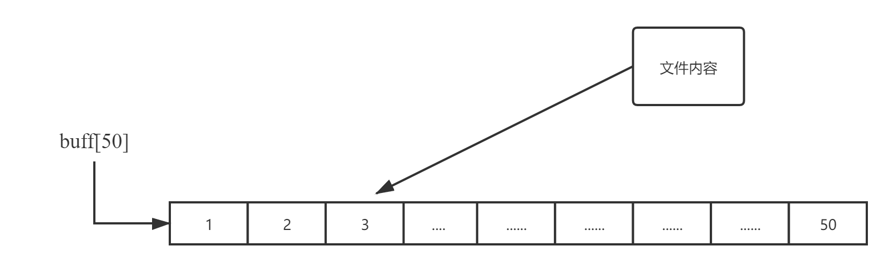
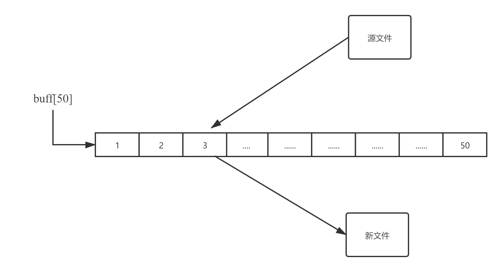
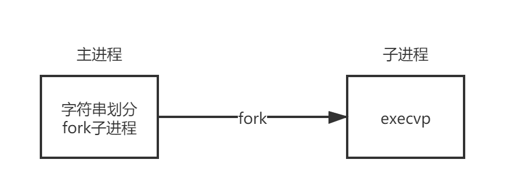
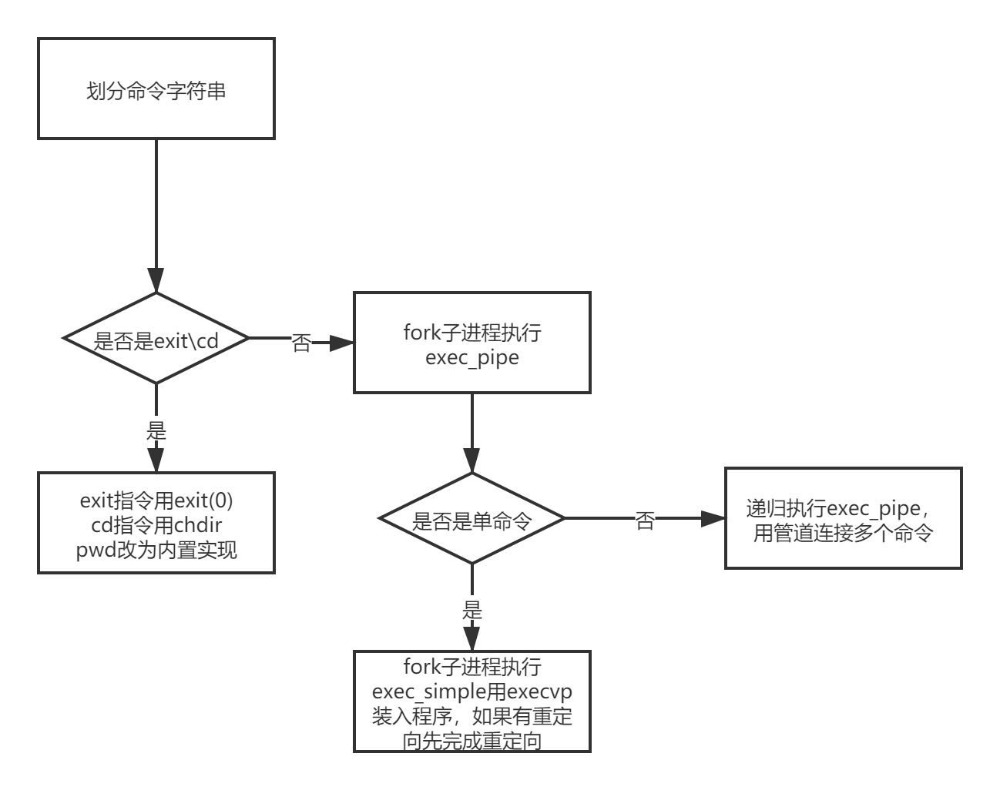
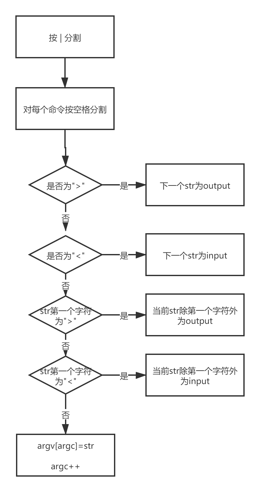
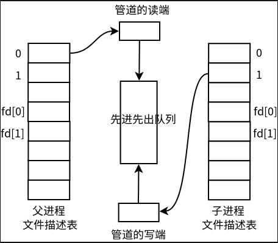
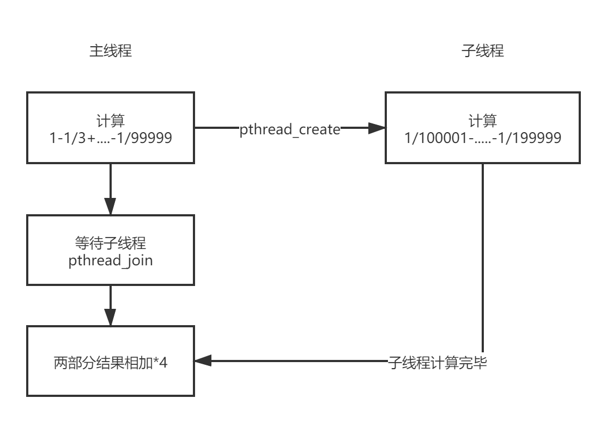
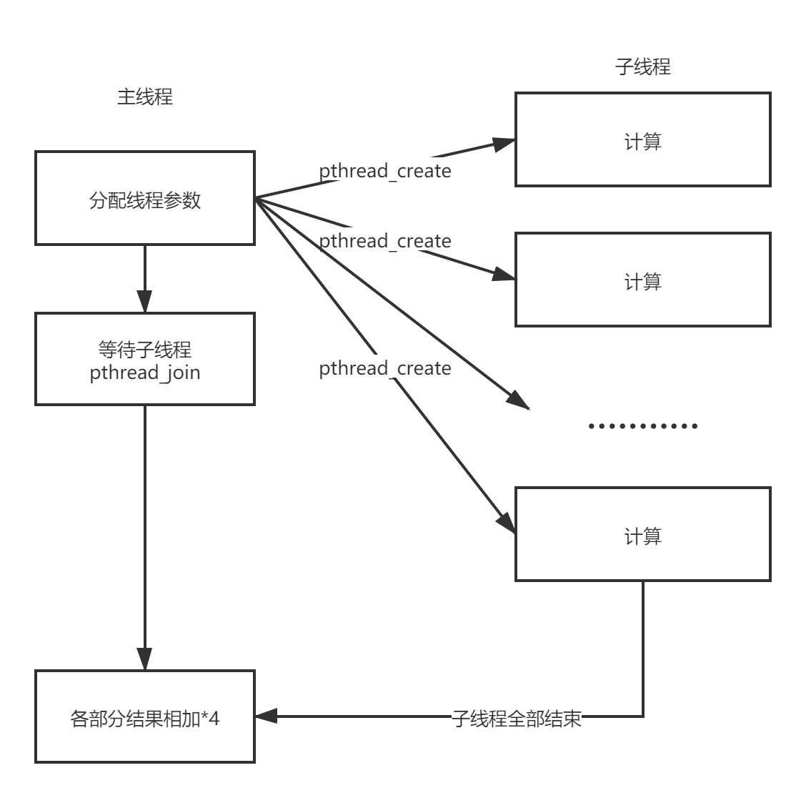
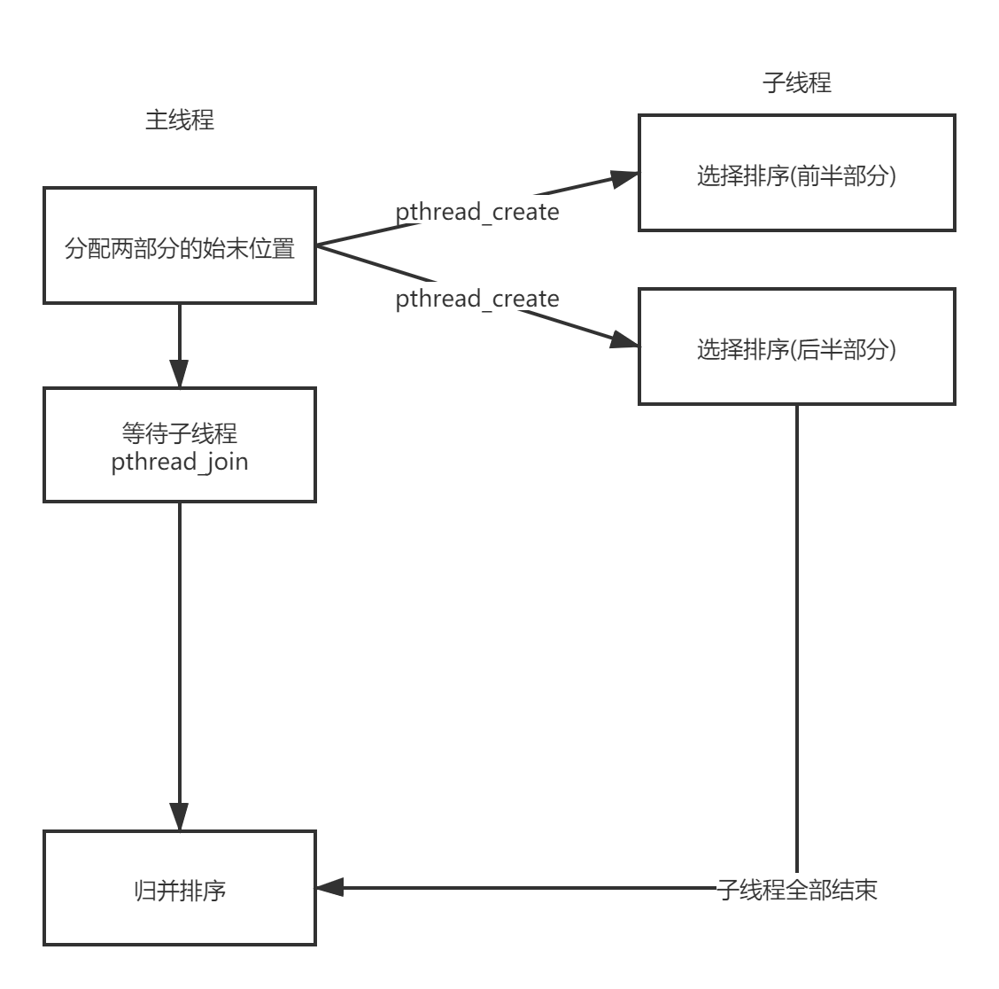
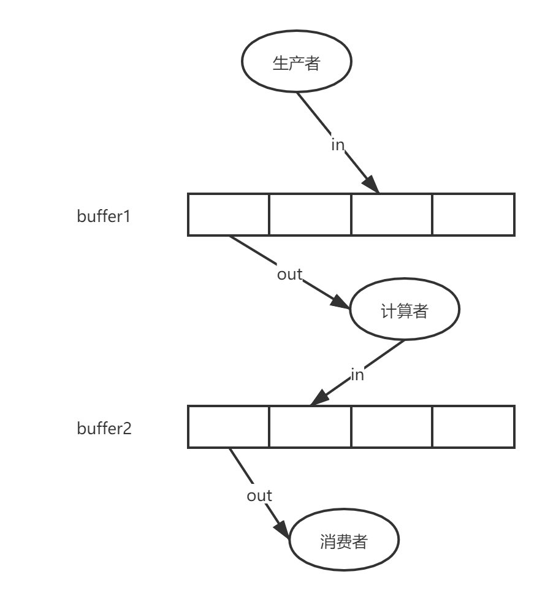

# 一、myecho.c

## 1.1 题目要求 

- myecho.c的功能与系统echo程序相同

- 接受命令行参数，并将参数打印出来,例子如下:

  ```shell
  $ ./myecho x
  x
  $ ./myecho a b c
  a b c
  ```

## 1.2 完成情况

​	完成了题目的全部要求

## 1.3  思路

这道题主要用到了C语言提供的命令行参数功能。

**函数原型：**

```C
int main(int agrc,char * argv[])
{
    ......
}
//argc : 表示命令行参数个数
//argv : 指针数组，存放命令行参数
```

 本题只需要用一个for循环打印**argv[1]-argv[argc-1]**即可,argv[0]中存放的是可执行程序本身的文件名，不需要打印输出


# 二、mycat.c

## 2.1 题目要求

- mycat.c的功能与系统cat程序相同
- mycat将指定的文件内容输出到屏幕，例子如下：
- 要求使用系统调用open/read/write/close实现

```shell
$ cat /etc/passwd 
root:x:0:0:root:/root:/bin/bash
daemon:x:1:1:daemon:/usr/sbin:/usr/sbin/nologin
bin:x:2:2:bin:/bin:/usr/sbin/nologin
...
$ ./mycat /etc/passwd 
root:x:0:0:root:/root:/bin/bash
daemon:x:1:1:daemon:/usr/sbin:/usr/sbin/nologin
bin:x:2:2:bin:/bin:/usr/sbin/nologin
...
```

## 2.2 完成情况

完成了题目的全部要求

## 2.3 思路

这题属于简单题，开一个长度为50字节的缓冲区buff，利用如下read函数在while循环中不断将文件内容调入到buff中再输出，当返回值count为0表示文件读取结束，跳出循环。

```C
count = read(fd, &buf, sizeof(buf));
//返回值count为读取字符个数
```




这里还有几个比较小的点要注意(输出错误提示):

- 参数个数必须为2

- 文件必须存在，不存在会打开失败

- 文件可能会读取失败

  

# 三、mycp.c

## 3.1 题目要求

- mycp.c的功能与系统cp程序相同

- 将源文件复制到目标文件，例子如下：

- 要求使用系统调用open/read/write/close实现

  ```shell
  $ cat /etc/passwd
  root:x:0:0:root:/root:/bin/bash
  daemon:x:1:1:daemon:/usr/sbin:/usr/sbin/nologin
  bin:x:2:2:bin:/bin:/usr/sbin/nologin
  ...
  $ ./mycp /etc/passwd passwd.bak 
  $ cat passwd.bak
  root:x:0:0:root:/root:/bin/bash
  daemon:x:1:1:daemon:/usr/sbin:/usr/sbin/nologin
  bin:x:2:2:bin:/bin:/usr/sbin/nologin
  .......
  ```

## 3.2 完成情况

完成了题目的全部要求

## 3.3 思路

这题和上一题类似，mycat是从源文件中读取再输出到屏幕上，mycp是将源文件中读取的内容写入到目标文件,以达到**复制**的效果。

```c
fd1 = open(argv[1], O_RDONLY, mode);//打开源文件，mode为777
fd2 = open(argv[2], O_CREAT | O_WRONLY | O_TRUNC, mode);//创建目标文件，mode为777
count1 = read(fd1, &buf, sizeof(buf));
count2 = write(fd2, &buf, count1);
```



注意点:

- 参数个数为3
- 源文件不存在要报错(打开失败)
- read和write函数返回值为-1会出错
- 注意open函数中的mode(访问方式)，权限不够会造成文件无法打开或写入


# 四、mysys.c

## 4.1 题目要求

- mysys的功能与系统函数system相同，要求用进程管理相关系统调用自己实现一遍
- **使用fork/exec/wait系统调用实现mysys**
- 不能通过调用系统函数system实现mysys

## 4.2 完成情况

完成了题目的全部要求

## 4.3 思路

​	这个题目主要是把命令 例如：**echo hello world** 先进行字符串分割(按空格割开,这里会分成三个str)，存放到argv数组中，再在主进程中fork一个子进程，在子进程中利用execvp装入程序，参数为argv

```C
//命令字符串分割
char *p = (char *) malloc(100);
strcpy(p, command);
argv[count] = strtok(p, " ");
while (argv[count] != NULL) {
    argv[++count] = strtok(NULL, " ");
}
```



注意点:

- 注意fork和execvp错误时的返回值
- 一开始用了比较笨的方法，相当于编译原理中的词法分析对字符进行分割，后来老师提示了strtok函数，可以方便的对字符串进行分割，但是使用strtok函数会破坏原字符串，所以要分割的字符串不能为常量**(切记!!!)**


# 五、sh1.c  sh2.c sh3.c

## 5.1 题目要求

- 该程序读取用户输入的命令，调用函数mysys(上一个作业)执行用户的命令
- 实现文件重定向
- 实现管道
- 只要求连接两个命令，不要求连接多个命令
- 不要求同时处理管道和重定向

## 5.2  完成情况

完成了题目的全部要求，并且完成以下的拓展

- 输入重定向
- 连接多个命令
- 同时处理管道和重定向

## 5.3 思路

整体框架如下:



### 5.3.1划分命令字符串

用以下结构体来表示每个命令的相关参数，例如 cat <input.txt | sort | uniq | cat >output.txt 可以划分为4个命令，用结构体数组单独存储每个命令的相关参数(命令参数个数，参数内容，重定向相关信息) 

```c
struct command {
    int argc;             //参数个数
    char *argv[MAX_ARGC]; //命令参数
    char *input;          //重定向输入的输入文件内容
    char *output;         //重定向输出的输出文件内容
};
int command_count = 0;    //命令个数
struct command commands[MAX_COMMANDS];//命令数组
```

划分流程如下:



   例如cat <input.txt | cat >output.txt ，先按照“|”划分得到cat <input.txt等命令，之后再划分这个字符串，先按照空格划分，再判断命令参数和重定向内容，重定向会遇到以下两种情况，这里介绍重定向读的划分方法，重定向写类似

-  cat <input.txt ：<和文件名中无空格，这种情况判断第一个字符是否是<，如果是则<input.txt中除<部分为读文件，用strtok_r进行划分(<)
- cat < input.txt :<和文件名中有空格，这种情况如果判断整个str为<，则下一个参数则为读文件

### 5.3.2程序装入执行

1. 先判断第一个命令是否是exit，如果是执行exit(0)退出
2. 判断第一个命令是否是cd，如果是用chdir改变当前工作目录
3. fork子进程，在子进程中完成程序的装入

- 根据上面的字符串划分，得到command_count(命令条数),如果command_count >1 为管道命令，如果command_count =1，则为非管道命令。
- 当command_count为1时，直接执行exec_simple，否则递归执行管道连接多个命令
- 例如cmd0、cmd1、cmd2，我们可以在父进程中执行cmd2，之后将cmd1和cmd0作为一个整体，在子进程中递归执行，当child_count(当前执行的命令在commands的下标位置+1)为0时，递归条件结束
- 这里不需要用wait等待，是因为多个进程是并发执行的，当某个进程没有输入到来时处于等待状态

### 5.3.3 管道连接

讲解一下递归程序主进程执行最后一条命令的管道连接，**<u>此处参考课程讲义</u>**

先创建管道，再创建子进程，子进程将继承文件描述符fd[0]和fd[1]，子进程dup2(fd[1], 1)，将标准输出定向到管道的写端(fd[1])，子进程使用标准输出将数据发送到父进程，父进程dup2(fd[0], 0)将标准输入定向到管道的读端(fd[0])



在cmd0|cmd1|cmd2的例子下，当cmd0|cmd1(作为一个整体，在子进程中)执行完毕得到输出，通过管道将输出传给cmd2的输入;对于cmd0和cmd1的管道连接在递归时同理。

### 5.3.4 重定向读写

此处比较简单，在exec_simple函数中，判断commands[child_count].input和commands[child_count].output是否为空，不为空的话完成重定向读/写


# 六、pi1.c

## 6.1 题目要求

使用2个线程根据莱布尼兹级数计算PI

- 莱布尼兹级数公式: 1 - 1/3 + 1/5 - 1/7 + 1/9 - ... = PI/4
- 主线程创建1个辅助线程
- 主线程计算级数的前半部分
- 辅助线程计算级数的后半部分
- 主线程等待辅助线程运行結束后,将前半部分和后半部分相加

## 6.2 完成情况

完成了题目的全部要求

## 6.3 思路

首先，指定NUMBER为100000，即计算
$$
1-1/3+1/5-1/7+......-1/199999=PI/4
$$
我们可以将计算分为两部分

**第一部分**:
$$
1-1/3+1/5-1/7+......-1/99999
$$
**第二部分**:
$$
1/100001-1/100003+............-1/199999
$$
​        主线程计算第一部分的内容，将结果存入变量master_output中，子线程计算第二部分内容，将结果存入worker_output中，这里需要注意，需要在主线程中调用pthread_join等待子线程运行完毕后，才计算

(master_output+worker_output)*4

```C
// 子线程计算1至 1/2 *(NUMBER / 2)-1
for (i = 1; i < 2 *(NUMBER / 2)+1; i+=2) {
        ..................
}  

// 主线程计算1/2 *(NUMBER / 2)+1 至 1/2*NUMBER-1
for (i = 2*(NUMBER / 2)+1; i < 2*NUMBER+1; i+=2){
        .........
}    

// 等待子线程worker
pthread_join(worker_tid, NULL);
```





# 七、pi2.c

## 7.1  题目要求

使用N个线程根据莱布尼兹级数计算PI

- 与上一题类似，但本题更加通用化，能适应N个核心
- 主线程创建N个辅助线程
- 每个辅助线程计算一部分任务，并将结果返回
- 主线程等待N个辅助线程运行结束，将所有辅助线程的结果累加
- 本题要求 1: 使用线程参数，消除程序中的代码重复
- 本题要求 2: 不能使用全局变量存储线程返回值

## 7.2 完成情况

完成了题目的全部要求

## 7.3 思路

该题和pi1类似，只不过多了两个要求使用 **线程参数**和 **等待线程函数pthread_join获取线程的返回结果**

以下的两个结构分别为线程参数结构体和返回值结构体，用来传参和获取线程返回值

```c
//参数结构体
struct param {
    int start;  //起始值
    int end;    //结束值
};
//返回值结构体
struct result {
    float sum;  //线程返回值
};
```

思路：将TOTAL值分为NR_CPU(实验中取值为4)个部分，开NR_CPU个线程分别计算等式左边的NR_CPU个部分，利用线程参数传递每部分的起始值和结束值，主线程等待四个线程的线程返回值，最后累加再*4即可得PI。

以下部分为分配四个计算线程的始末值，并且创建线程

```c
for (i = 0; i < NR_CPU; i++) {
        struct param *param;
        param = &params[i];
        param->start = i * NR_CHILD; 
        param->end = (i + 1) * NR_CHILD;
        pthread_create(&workers[i], NULL, compute, param);
 }

pthread_join(workers[i], (void **)&result);  //result结构体中sum为该线程返回值

//每个线程计算2*param->start+1 至 2*param->end+1
for (i = 2*param->start+1; i < 2*param->end+1; i+=2) {
        .......
}    
```



# 八、sort.c

## 8.1 题目要求

多线程排序

- 主线程创建两个辅助线程
- 辅助线程1使用选择排序算法对数组的前半部分排序
- 辅助线程2使用选择排序算法对数组的后半部分排序
- 主线程等待辅助线程运行結束后,使用归并排序算法归并子线程的计算结果
- 本题要求 1: 使用线程参数，消除程序中的代码重复


## 8.2 完成情况

完成了题目的全部要求

## 8.3 思路

两个辅助线程对数组的前半部分采用选择排序，后半部分采用选择排序；等待两个子线程结束后，主线程采用归并排序排序整个数组，<u>**采用线程参数传递参数**</u>

线程参数结构体如下所示:

```c
struct param {
    int *array;  //排序数组的名称
    int start;   //排序部分的初始下标
    int end;     //排序部分的末下标
};
```



```c
//分配数组前后两部分的下标始末值，再创建线程
    for (i = 0; i < NR_CPU; i++) {
        struct param *param;
        param = &params[i];
        param->array = array;
        param->start = i * NR_CHILD;
        param->end = (i + 1) * NR_CHILD;
        pthread_create(&workers[i], NULL, selectSort, param);
}
```


# 九、pc1.c

## 9.1 题目要求

使用条件变量解决生产者、计算者、消费者问题

- 系统中有3个线程：生产者、计算者、消费者
- 系统中有2个容量为4的缓冲区：buffer1、buffer2
- 生产者生产'a'、'b'、'c'、‘d'、'e'、'f'、'g'、'h'八个字符，放入到buffer1
- 计算者从buffer1取出字符，将小写字符转换为大写字符，放入到buffer2
- 消费者从buffer2取出字符，将其打印到屏幕上


## 9.2 完成情况

完成了题目的全部要求


## 9.3 思路



本题对buffer1来说，计算者是消费者，对buffer2来说计算者是生产者。因为是对两个buffer缓冲区进行操作，所以需要设置两个<u>**in、out、mutex、wait_ empty_buffer 和 wait_full_buffer**</u>。

这里简要介绍下四个函数:

```c
//该函数判断buffer是否为空,flag为标志位,为1表示buffer1，为2表示buffer2
int buffer_is_empty(int flag)
{
	..........
}
//该函数判断buffer是否满,flag为标志位,为1表示buffer1，为2表示buffer2
int buffer_is_full(int flag)
{
   .......................
}
//该函数用于获取buffer的值,flag为标志位,为1表示buffer1，为2表示buffer2
int get_item(int flag)
{
   ........................
}
//该函数用于将item加入到buffer中,flag为标志位,为1表示buffer1，为2表示buffer2
void put_item(int item, int flag)
{
   ................................
}
```

该程序有三个线程，主线程为生产者，两个子线程为消费者和计算者，下面介绍三个线程的运行情况。

- 生产者(produce):  因为要对buffer1进行操作，所以先要获得buffer1的锁，然后判断buffer是否满，如果满则阻塞，否则放入新字符，唤醒被阻塞的计算者线程，释放锁

  

- 计算者(calculate)：先获得buffer1的锁，再判断buffer1是否为空，如果空则阻塞线程，否则取一个字符(再转换为大写)，唤醒被阻塞的生产者线程，释放锁。接下来计算者充当buffer2的生产者身份，先获取buffer2的锁，再判断buffer2是否满，如果满则阻塞线程，否则放入新字符，唤醒被阻塞的消费者线程，释放锁

  

- 消费者(consume): 先获取buffer2的锁，再判断buffer2是否为空，如果空则阻塞线程，否则取一个字符输出，再唤醒被阻塞的计算者线程，释放锁。

  

关于为什么pthread_cond_wait需要互斥锁mutex作为参数可以参考我的操作系统实践老师的这篇文章:

https://zhuanlan.zhihu.com/p/58838318


# 十、pc2.c

## 10.1 题目要求

使用条件变量解决生产者、计算者、消费者问题

- 功能和前面的实验相同，使用信号量解决


## 10.2 完成情况

完成了题目的全部要求


## 10.3 思路


流程和pc1相同，只不过这里采用的是信号量机制。

定义6个信号量：

| 信号量名           | 初值 | 说明                    |
| ------------------ | ---- | ----------------------- |
| mutex_sema1        | 1    | buffer1的锁             |
| mutex_sema2        | 1    | buffer2的锁             |
| empty_buffer_sema1 | 4    | buffer1空闲区值         |
| empty_buffer_sema2 | 4    | buffer2空闲区值         |
| full_buffer_sema1  | 0    | buffer1已存放字符的个数 |
| full_buffer_sema2  | 0    | buffer2已存放字符的个数 |

该程序有三个线程，主线程为生产者，两个子线程为消费者和计算者，下面介绍三个线程的运行情况。

- 生产者(produce):  先执行**<u>sema_wait(&empty_buffer_sema1)</u>** ，获取buffer1的一个空闲位置，如果成功，则empty_buffer_sema1减1,获取buffer1的锁，放入新字符，释放锁，再执行<u>**sema_signal(&full__buffer_sema1)**</u> ，此时full_buffer_sema1加1，唤醒被阻塞的计算者线程

  

- 计算者(calculate)：先充当buffer1的消费者，先执行**<u>sema_wait(&full__buffer_sema1)</u>** ，判断是否buffer1有值，如果成功，则full_buffer_sema1减1，获取buffer1的锁，得到字符，再转换为大小，释放锁，再执行**<u>sema_signal(&empty__buffer_sema1)</u>**，此时empty__buffer_sema1加1，唤醒被阻塞的生产者线程。再充当buffer2的生产者，执行**<u>sema_wait(&empty_buffer_sema2)</u>**，判断buffer2是否有空位，如果成功，则empty_buffer_sema2减1,获取buffer1的锁，放入转换好的字符，释放锁，再执行<u>**sema_signal(&full_buffer_sema1)**</u> ，此时full_buffer_sema2加1，唤醒被阻塞的消费者线程

  

- 消费者(consume): 先执行**<u>sema_wait(&full_buffer_sema2)</u>** ，判断是否buffer2有值，如果成功，则full_buffer_sema2减1，获取buffer2的锁，得到字符并打印，释放锁，再执行**<u>sema_signal(&empty__buffer_sema2)</u>**，此时empty__buffer_sema2加1，唤醒被阻塞的计算者线程。